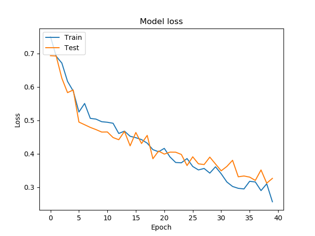

# Home assignment - Tomato allergies

This repos presents results from the home assignement proposed here : https://github.com/Foodvisor/home-assignment

# Requirements

Additional libraries are needed to run this code :
* Tensorflow 2.0
* sckikit-learn
* matplotlib
* numpy

# Test the code

Make sure to set the correct paths in the [config.py](https://github.com/arimboux/Foodvisor_homeAssignment/blob/master/config.py) file
```python
LABELS_PATH = r'D:\Foodvisor\dataset\label'
IMGS_PATH = r'D:\Foodvisor\dataset\imgs\assignment_imgs'
CKPT_PATH = r'D:\Foodvisor\ckpt\model\model'
LOG_PATH = r'D:\Foodvisor\logs\model'
```

CKPT_PATH is the path to the model checkpoint that can be found [here](https://github.com/arimboux/Foodvisor_homeAssignment/tree/master/ckpt)
(file is too big for a release).

LOG_PATH is used to store the log provided during training for a TensorBoard monitoring. 
If this directory doesn't exist it will be created in the main script.

[main.py](https://github.com/arimboux/Foodvisor_homeAssignment/blob/master/main.py) is used to train, test and evaluate a network:

```console
python main.py --train
```

* Train a network from scratch. Some parameters can be changed directly in the [config.py](https://github.com/arimboux/Foodvisor_homeAssignment/blob/master/config.py) file.

```console
python main.py --test --image_path 'b9cab18e031f11a8b0c76e6f8dd64965.jpeg'
```

* Test a trained network retrieved from a checkpoint found in CKPT_PATH. The path to the images directory is directly
prefixed to the image name

```console
python main.py --eval
```

* Evaluate the error rate of a trained network on a set of images removed from the train (and validation) set. This set can be found in
[config.py](https://github.com/arimboux/Foodvisor_homeAssignment/blob/master/config.py) file (EVAL_IMGS).

# Results
 

# Credits

https://www.tensorflow.org/tensorboard/get_started

https://www.kaggle.com/nabanitaroy/cnn-binary-classification-model/notebook